# Claude Code Kit for Mac (CCKit)

<p align="center"></p>

**[Claude Code](https://claude.ai/code) CLI 의 주요 명령·작업을 macOS 메뉴바 패널에서 클릭 한 번에 조작**

터미널에서 `/remote-control`, `/bg`, `/rename`, `claude --resume`, `claude agents` 같은 명령을 일일이 치는 대신 — 메뉴바에 상주하는 컨트롤 패널에서 세션을 **열고·닫고·관리하고, 백그라운드로 보내고, 폰/웹에서 원격 조종**할 수 있습니다.

Windows 판 → [Claude Code Kit](https://github.com/hull-kr/Claude-Code-Kit)

<p align="center">
  <b>⬇️ 설치 — 터미널에 한 줄</b><br>
  <code>curl -fsSL https://github.com/hull-kr/Claude-Code-Kit-Mac/releases/latest/download/install.sh | bash</code><br>
  macOS 12 이상 &nbsp;·&nbsp; Apple Silicon · Intel &nbsp;·&nbsp; 무료(Freeware)
</p>

<p align="center">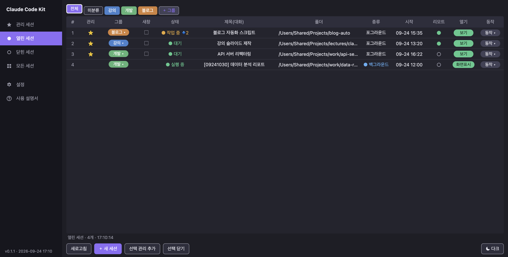</p>
<p align="center">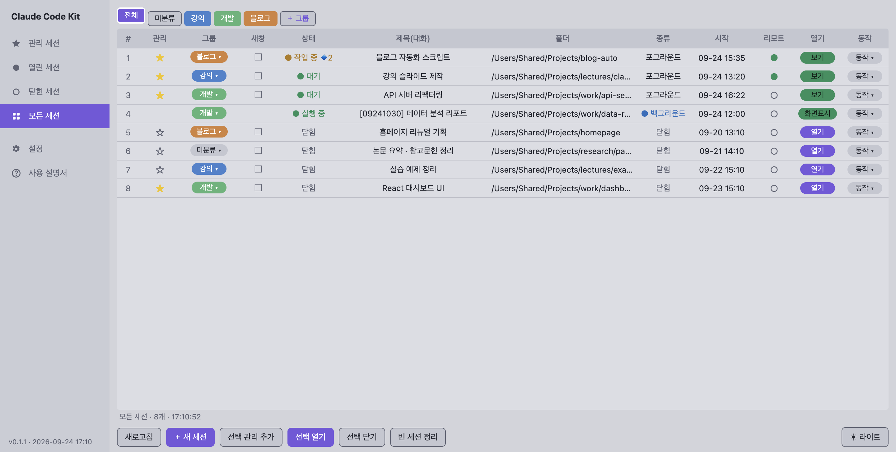</p>

---

## 🎛️ CLI 명령 ↔ UI 매핑

터미널에서 치던 것을 패널 버튼으로:

| Claude Code CLI | CCKit 패널 |
|---|---|
| `claude` (새 세션) | **＋ 새 세션** 버튼 (폴더·이름·그룹·원격·관리 옵션) |
| `claude --resume <id>` | 닫힌 세션 **열기** / **전체 이어서 열기** |
| `/remote-control` | 세션의 **리모트** 토글 (닫힌 세션도 바로 리모트로 열기) |
| `/bg` (백그라운드) | **bg 전환** |
| `/rename` | **제목 칸 더블클릭** |
| `claude agents` | 상태칸 **🔹N 뱃지 → 클릭** (서브에이전트 목록) |
| `claude attach <id>` | 백그라운드 **화면표시** / **화면닫기** |
| `claude stop` / `rm` | 백그라운드 **세션 닫기** |
| 이미지 경로 입력 | **⌃⇧V** (클립보드 이미지 자동 저장·경로 입력) |

> ℹ️ **`ccd`** 는 Claude 순정 명령이 아니라 **CCKit 이 추가하는 단축 명령**입니다 (`ccd = claude --dangerously-skip-permissions`). 아래 [ccd 단축 명령](#️-ccd-단축-명령) 참고.

---

## 📥 설치

1. **터미널**(응용 프로그램 → 유틸리티 → 터미널, 또는 ⌘+Space 로 "터미널" 검색)을 엽니다.
2. 아래 한 줄을 붙여 넣고 Enter:
   ```bash
   curl -fsSL https://github.com/hull-kr/Claude-Code-Kit-Mac/releases/latest/download/install.sh | bash
   ```
   ```
   ▶ 내려받는 중 (arm64): https://github.com/hull-kr/Claude-Code-Kit-Mac/releases/latest/download/CCKit-mac-arm64.zip
   ▶ 압축 푸는 중
   ▶ 설치: /Applications/Claude Code Kit.app
   ▶ 실행

   ✅ 설치 완료 — 화면 오른쪽 위 메뉴바의 ✦ 아이콘을 누르세요.
   ```
3. 화면 **오른쪽 위 메뉴바의 ✦ 아이콘** → **컨트롤 패널**.
4. 처음 세션을 열 때 **"Claude Code Kit 이 Terminal 을 제어하려고 합니다"** → **[허용]**.
   세션 열기·닫기·리모트·이름 바꾸기가 터미널에 명령을 넣는 방식이라 꼭 필요합니다.

- 앱은 **`/Applications/Claude Code Kit.app`**(Finder → 응용 프로그램)에 설치됩니다. **Dock 에 고정**하려면 응용 프로그램 폴더에서 Dock 으로 끌어다 놓으세요.
- 같은 명령을 다시 실행하면 **최신 버전으로 업데이트**됩니다 (앱 안 **설정 → 업데이트 → 지금 업데이트** 도 가능).
- Apple Silicon(M1~) · Intel 은 자동으로 골라 받습니다.

> **왜 .dmg 대신 한 줄 설치인가요?**
> 이 프로그램은 **무료라 Apple 유료 개발자 서명·공증을 하지 않았습니다.** 브라우저로 받은 앱은 macOS 가 "확인할 수 없는 개발자" 로 막고,
> 최신 macOS 에서는 우클릭 → 열기로도 열리지 않습니다. **터미널로 받으면 이 경고 없이 설치됩니다.**
> .dmg 도 [릴리즈](https://github.com/hull-kr/Claude-Code-Kit-Mac/releases/latest)에 있지만, 그걸 쓰면 설치 후
> **시스템 설정 → 개인정보 보호 및 보안 → "그래도 열기"** 를 누르고 암호를 넣어야 합니다.

### 🧩 선행 프로그램 확인·설치

설정의 **선행 프로그램** 에서 **Node.js · Python · Git · Claude Code** 의 **설치 여부 · 버전 · 최신판인지**를 한눈에 보고, 버튼 하나로 설치/재설치합니다.

- **공식 배포처**로 설치합니다 — Node.js · Python · Git 은 **Homebrew**, Claude Code 는 **Anthropic 공식 설치 스크립트**
- 최신판은 `nodejs.org` · `python.org` · Git 릴리즈 · npm 에서 자동으로 확인
- Homebrew 가 없으면 먼저 Homebrew 를 설치합니다
- 설치는 **터미널 창에서 진행**돼 진행 상황이 보이고, 암호를 물으면 Mac 로그인 암호를 입력하면 됩니다

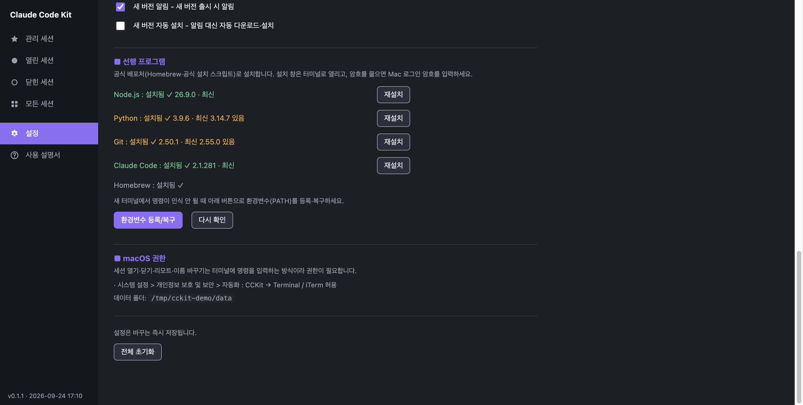

> 💡 **Claude Code 가 없어도 괜찮습니다.** 설정 → 선행 프로그램 → Claude Code **[설치]** 한 번이면 됩니다.

### 명령이 인식되지 않을 때

`claude` · `node` 명령을 못 찾는다고 나오면 **터미널을 닫고 새로 여세요.** 그래도 안 되면 **설정 → `환경변수 등록/복구`** —
Homebrew 와 `~/.local/bin`(claude 설치 위치)을 `~/.zprofile` 에 등록합니다 (기존 파일은 백업).

---

## ⭐ 주요 기능 요약

| 기능 | 한 줄 요약 |
|---|---|
| 🖼️ **이미지 붙여넣기** | `⌃⇧V` 로 클립보드 이미지 저장 + 경로 자동 입력 |
| 🗂️ **컨트롤 패널** | 세션 열기·닫기·관리, 상태 색, 그룹, 다중 선택, 정렬, 다크/라이트 |
| 🖱️ **우클릭 메뉴** | 세션 하나로 할 수 있는 모든 것(재시작·리모트·관리·bg 전환·이름 변경 등)을 그룹으로 |
| ➕ **새 세션** | 폴더·이름·그룹·원격·관리 옵션으로 새 세션 한 번에 생성 |
| 🌙 **bg 전환** | 실행 중 세션을 백그라운드로 (창 닫고 계속 실행) |
| 📱 **리모트 컨트롤** | 폰/웹(claude.ai/code)에서 이 Mac 세션 조종 |
| 🔹 **서브에이전트 표시** | 상태칸 `🔹N` → 클릭 시 작업 중 에이전트 목록 |
| ★ **관리 / 이어서 열기** | 즐겨찾기 세션 + 한 번에 복원 |
| 🏷️ **그룹** | 강의·개발처럼 세션을 묶고 탭으로 걸러 보기 |
| 🔄 **재부팅 자동 복원** | 로그인 시 재부팅 직전 세션 자동 복원 |
| 🧩 **선행 프로그램** | Node.js·Python·Git·Claude Code 확인·설치·최신판 비교 |
| 🔔 **업데이트** | 새 버전 알림 · 앱 안에서 바로 업데이트 |
| 🌐 **다국어** | 한국어 / English / 日本語 / 中文 |

---

## ✨ 기능 상세

### 🖼️ 이미지 붙여넣기
캡처(`⌘`+`⇧`+`4` 등) 후 터미널에서 **`⌃`+`⇧`+`V`** → 클립보드 이미지가 **그 세션 폴더의 `.tmp/clipboard/`** 에 저장되고, 그 경로가 입력칸에 자동으로 들어갑니다. (미리보기 팝업이 잠깐 뜸)

```
❯ /Users/me/Projects/blog-auto/.tmp/clipboard/clip-20260924-153824.png
```

- **iTerm2** — 바로 입력됩니다.
- **Terminal.app** — **손쉬운 사용** 권한을 주면 바로 입력되고, 없으면 경로가 클립보드에 들어가니 `⌘V` 로 붙여넣으면 됩니다.
- 단축키·미리보기 시간/크기·알림은 설정에서 바꿀 수 있습니다.

### 🗂️ 컨트롤 패널
- **탭:** ★관리 / ●열린 / ○닫힌 / ▦모든 세션 / ⚙설정 / ?사용 설명서
- **상태 색:** 작업 중(주황) · 대기(초록) · 닫힘(회색) · 백그라운드(파랑)
- **각 세션 칸:** 관리(★) · 그룹 · 새창 · 리모트(●/○) · 열기(보기/열기/화면표시) · 동작 — 여러 개 선택(⌘/⇧ 클릭)해 한꺼번에도
- **폴더 칸 클릭** = Finder 로 그 폴더 열기
- **더블클릭:** 제목칸 = 이름 바꾸기, 상태·종류·시작칸 = 상세 정보
- **모든 세션** 탭에서 열린·닫힌 세션을 한눈에 (닫힌 세션 열기/삭제, 빈 세션 정리)

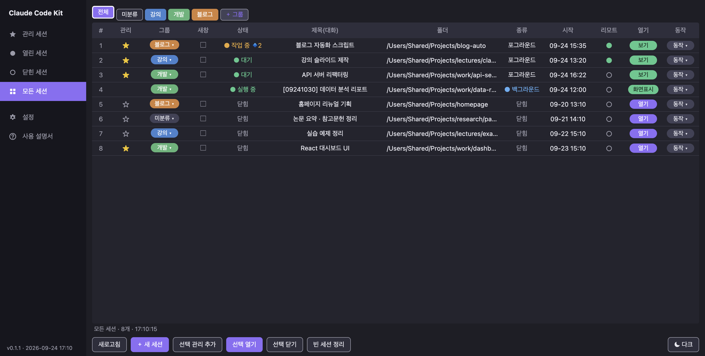

### 🖱️ 우클릭 메뉴
세션 행을 **우클릭**하면 그 세션으로 할 수 있는 것이 전부 그룹으로 모여 뜹니다. 지금 상태에 맞는 항목만 나옵니다(리모트가 켜져 있으면 "리모트 끄기", 관리 세션이면 "관리 제거").

- **정보** — 상세 정보, 세션ID 복사
- **탐색** — 터미널 창 앞으로, 폴더 열기, 이름 바꾸기
- **그룹** — 그룹 지정
- **상태 전환** — 세션 재시작(닫고 바로 다시 열기) · 리모트 켜기/끄기 · 관리 추가/제거 · bg 전환
- **닫기/삭제** — 아래쪽에 따로 구분

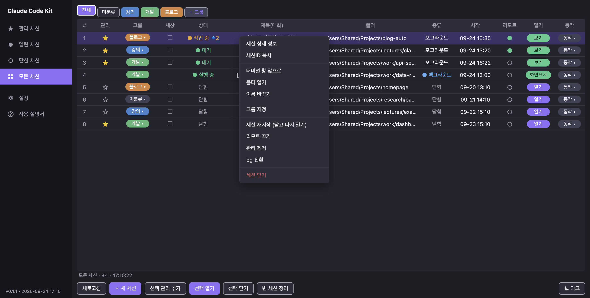

### ➕ 새 세션
하단 **`＋ 새 세션`** → 폴더 선택 + 세션명 + 그룹 + **원격 연결** + 관리 추가. 새 폴더의 "이 폴더를 신뢰?" 물음은 자동으로 통과합니다.
원격 연결을 체크하면 세션이 뜨는 대로 리모트까지 켜고, 적용하지 못한 것이 있으면 알려 줍니다.

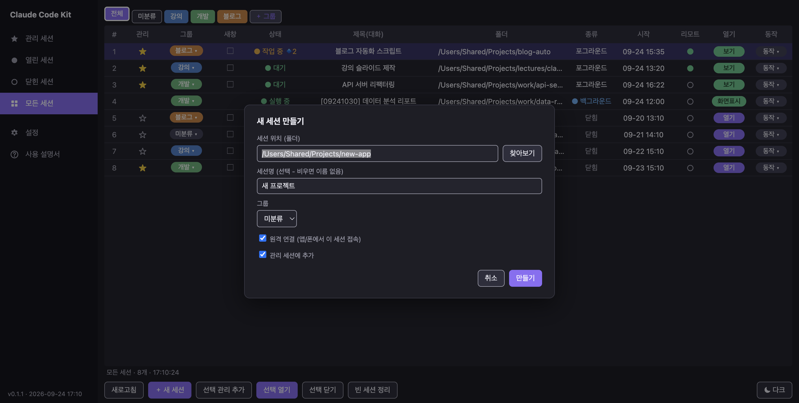

### 🌙 bg 전환
실행 중 세션을 백그라운드로 보냅니다. 터미널 창은 닫히고 세션은 계속 실행 — 이름 앞에 `[MMddHHmm]` 시각이 붙고, 리모트가 켜져 있었으면 백그라운드에서도 이어받습니다.
**화면표시**로 언제든 다시 보고, **화면닫기**로 창만 닫아도 계속 돕니다.

### 📱 리모트 컨트롤 — 폰/웹에서 이 Mac 조종
세션의 **리모트**를 켜면 `/remote-control` 이 실행돼, **claude.ai/code 또는 모바일 Claude 앱**에서 그 세션이 그대로 보이고 조종됩니다.

1. 패널에서 세션의 **리모트 ○** 를 누름 → 2. "리모트를 켰습니다" → 3. 패널에 **● 켜짐** → 4. **claude.ai/code(웹/앱)에서 그 세션 조종**

- 처음 켤 때 claude 가 묻는 동의 질문도 자동으로 통과합니다.
- **닫힌 세션**의 리모트를 누르면 세션을 열고 바로 리모트를 켭니다.
- 켜짐/꺼짐은 세션의 실제 상태로 확인해 표시합니다.
- 설정의 **절전 방지**를 켜 두면 잠자기로 끊기지 않고, **리모트 유휴 유지**가 오래 쉰 세션을 다시 연결해 둡니다.
- 입력칸에 **보내지 않은 글자가 있으면** 섞여서 전송되지 않도록 명령을 넣지 않고 알려 줍니다.

### 🔹 서브에이전트 표시
세션이 Task/Agent 를 돌리면 상태칸에 **`🔹N`** 뱃지 → 클릭하면 작업 중인 서브에이전트 목록 팝업 (끝나면 자동으로 사라짐).

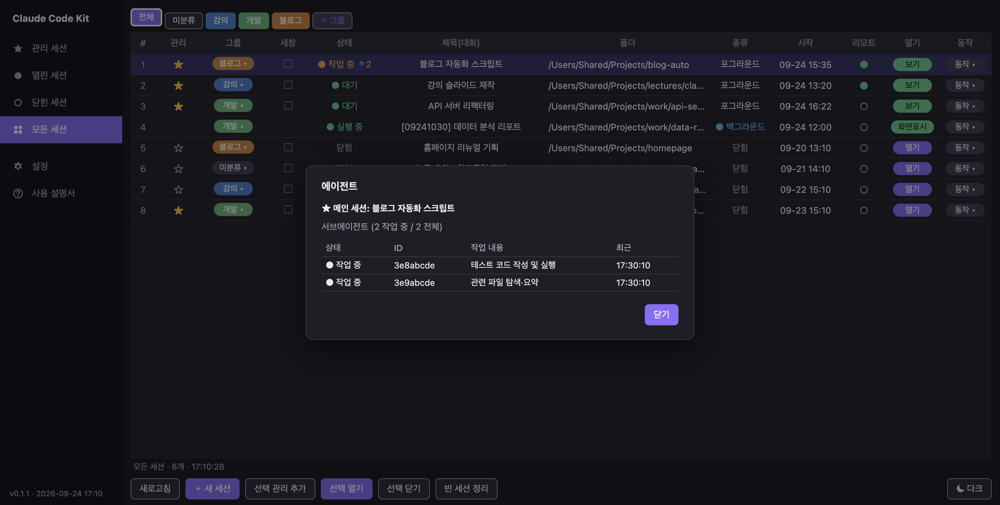

### ★ 관리 세션 / 이어서 열기 · 🏷️ 그룹
자주 쓰는 세션을 **관리(★ 금색 별)** 에 담아두면 닫혀도 '관리 세션' 탭에 남습니다. **`전체 이어서 열기`** 한 번이면 열어뒀던 폴더에서 대화까지 이어서 한꺼번에 다시 엽니다.

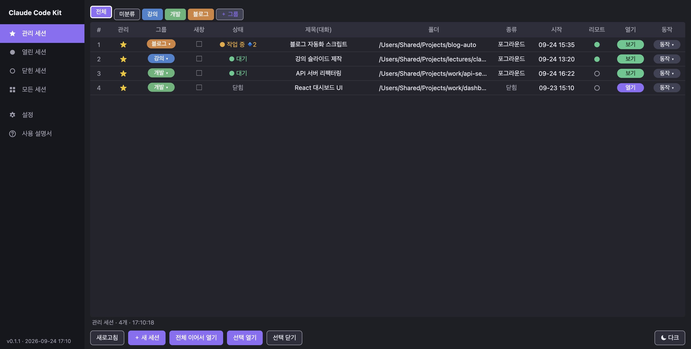

**그룹**으로 세션을 묶고(`＋ 그룹`, 그룹 칸 클릭), 위쪽 탭으로 걸러 봅니다. 탭은 끌어서 순서를 바꾸고, 우클릭으로 이름 변경·삭제.

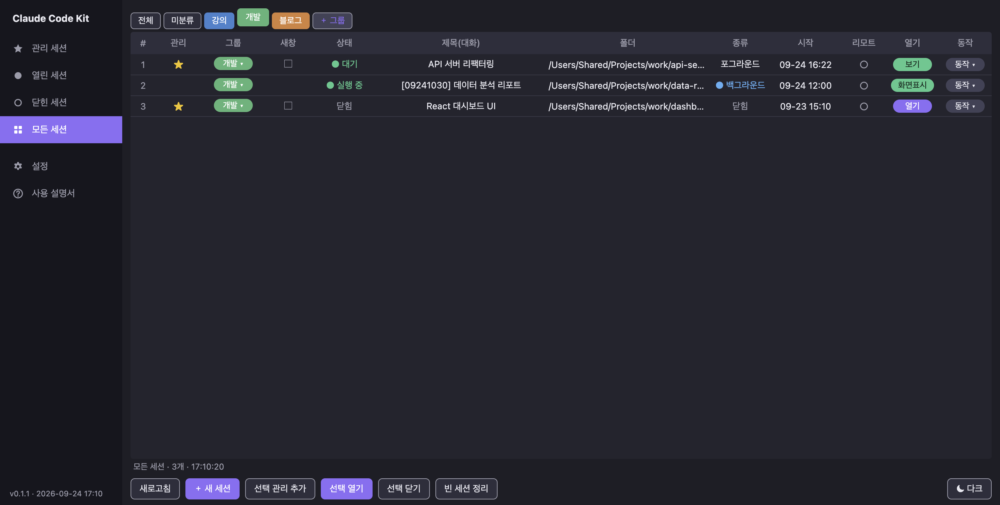

### 📋 상세 정보 · ⚙ 설정 · 메뉴바

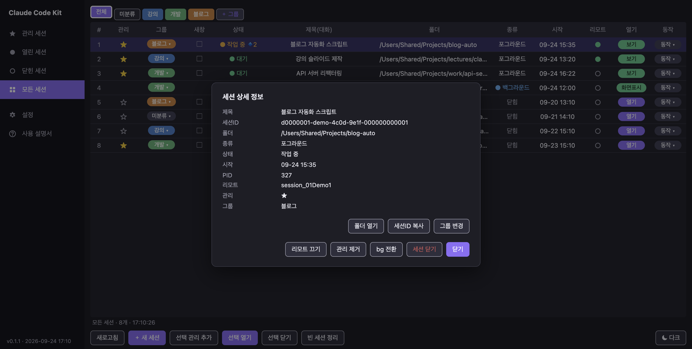<br>
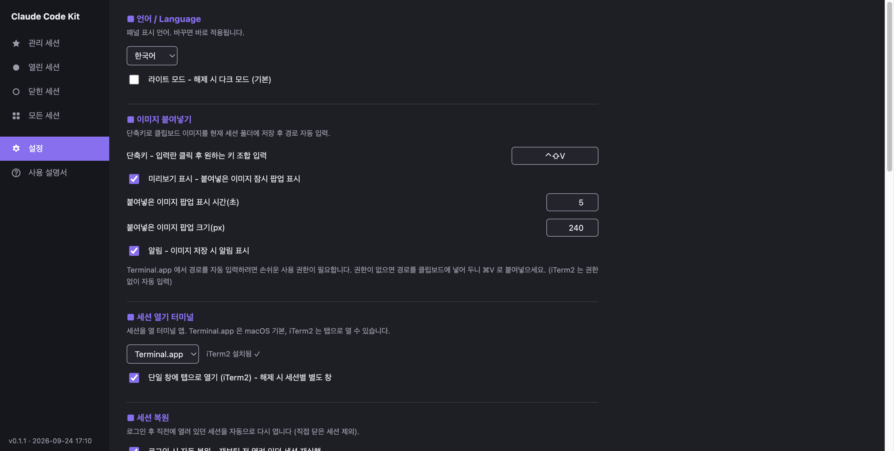<br>
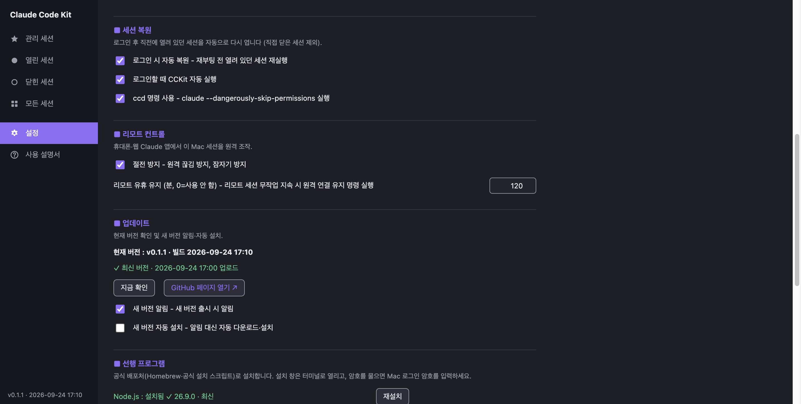

- **상세 정보**(상태칸 더블클릭): 경로/세션ID 확인·복사 + 폴더 열기·그룹 변경 + 그 세션의 모든 동작
- **설정:** 언어(한/영/일/중) · 라이트/다크 · 이미지 붙여넣기(단축키·미리보기·알림) · 터미널(Terminal.app / iTerm2, 탭 모드) ·
  로그인 시 자동 실행/자동 복원 · ccd · 절전 방지 · 리모트 유휴 유지 · 업데이트(알림/자동 설치) · 선행 프로그램 · 전체 초기화
- **메뉴바 ✦ 메뉴:**
  ```
  컨트롤 패널
  ──────────
  세션 이어서 열기  ▸  (관리 세션 목록 · 관리 세션 이어서 열기 · 현재 세션 저장 · 관리 세션에서 제거)
  열린 세션         ▸  (누르면 그 터미널 창 앞으로)
  ──────────
  설정 · 사용법 · 업데이트 확인 · 다시 시작
  ──────────
  종료
  ```

### 📖 사용 설명서
패널 왼쪽 **? 사용 설명서** (또는 메뉴바 → 사용법) — 4개 언어.

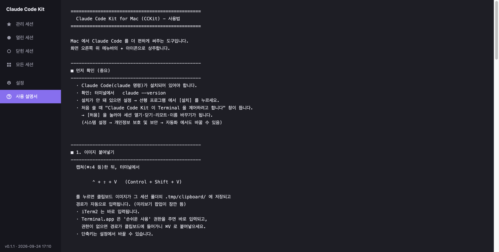

### 🔄 재부팅 자동 복원
설정에서 켜두면 **재부팅 직전 열려 있던 세션들을 로그인할 때 자동으로 다시** 엽니다. (로그인 항목에 자동 등록)

### ⌨️ ccd 단축 명령
```
ccd = claude --dangerously-skip-permissions
```
어느 폴더에서든 `ccd` 만 치면 **권한 확인을 건너뛰고(bypass permissions on)** 바로 Claude Code 가 실행됩니다.

```
$ ccd
 ▐▛███▜▌   Claude Code
 ...
  ⏵⏵ bypass permissions on (shift+tab to cycle)
```

**설정 → 세션 복원 → `ccd 명령 사용`** 체크로 설치/해제합니다 (`~/.local/bin/ccd`).

---

## 📋 요구사항
- **macOS 12 이상** (Apple Silicon · Intel)
- **Terminal.app**(기본) 또는 **iTerm2**
- **Claude Code CLI** — 없으면 설정 → 선행 프로그램에서 설치
- 리모트 컨트롤은 Claude 구독(Pro · Max · Team · Enterprise) 계정 로그인 필요

## 🗑️ 제거
```bash
osascript -e 'tell application "Claude Code Kit" to quit'
rm -rf "/Applications/Claude Code Kit.app" ~/Library/Application\ Support/CCKit ~/Library/Application\ Support/Claude\ Code\ Kit
```
세션 기록(`~/.claude`)은 Claude Code 의 것이라 건드리지 않습니다.

## 📄 라이선스 / 제작
- **제작:** [hull.kr](https://hull.kr) · **문의:** kimkap10@gmail.com
- **무료 자유 소프트웨어(Freeware)** — 자유롭게 받아 쓰세요. Apple 개발자 서명·공증은 하지 않았습니다.
- © 2026 hull.kr
