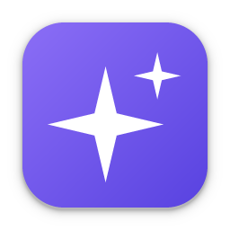

# Claude Code Kit for Mac

<p align="center"></p>

macOS 메뉴바에서 **Claude Code 세션을 한눈에 보고 · 열고 · 닫고 · 리모트로 켜는** 도구입니다.
Windows 판 [Claude Code Kit](https://github.com/hull-kr/Claude-Code-Kit) 의 macOS 판입니다.

## 설치 (터미널에 한 줄)

```bash
curl -fsSL https://github.com/hull-kr/Claude-Code-Kit-Mac/releases/latest/download/install.sh | bash
```

- Apple Silicon(M1~) · Intel Mac 을 자동으로 골라 `/Applications` 에 설치하고 실행합니다.
- 다시 실행하면 최신 버전으로 업데이트됩니다. (앱 안의 설정 → 업데이트 에서도 가능)
- 설치가 끝나면 화면 오른쪽 위 메뉴바의 **✦** 아이콘을 누르세요.

> **왜 .dmg 대신 한 줄 설치인가요?** 브라우저로 받은 앱은 macOS 가 "확인할 수 없는 개발자" 로 막고,
> 최신 macOS 에서는 우클릭 → 열기로도 열리지 않습니다. 터미널로 받으면 이 경고 없이 설치됩니다.
> .dmg 도 릴리즈에 있지만, 그걸 쓰면 설치 후 **시스템 설정 → 개인정보 보호 및 보안 → "그래도 열기"** 를 눌러야 합니다.

### 처음 실행할 때

- **"Claude Code Kit 이 Terminal 을 제어하려고 합니다"** → **[허용]** — 세션 열기·닫기·리모트·이름 바꾸기에 필요합니다.
- (선택) 이미지 붙여넣기를 Terminal.app 에서 자동 입력하려면 **손쉬운 사용** 권한을 허용하세요. (iTerm2 는 필요 없음)
- Claude Code(`claude`)가 없으면 **설정 → 선행 프로그램** 에서 설치할 수 있습니다.

## 주요 기능

| 기능 | 설명 |
|---|---|
| 세션 목록 | 관리 · 열린 · 닫힌 · 모든 세션, 그룹(카테고리), 상태(작업 중/대기), 서브에이전트 수 |
| 세션 조작 | 열기(대화 이어서) · 창 앞으로 · 재시작 · 닫기 · 이름 바꾸기 · 폴더 열기 · 삭제 |
| 리모트 컨트롤 | 폰/웹 Claude 앱에서 이 Mac 세션 조종 — 켜기/끄기, 유휴 유지, 닫힌 세션도 바로 리모트로 |
| 백그라운드 | bg 전환([날짜] 이름·리모트 이어받기), 화면표시/화면닫기 |
| 새 세션 | 폴더·이름·그룹·리모트·관리를 골라 한 번에 (폴더 신뢰 질문 자동 통과) |
| 이미지 붙여넣기 | ⌃⇧V → 캡쳐 이미지를 세션 폴더에 저장하고 경로 입력 |
| 자동 복원 | 재부팅 전 열려 있던 세션을 로그인 때 다시 열기 |
| 선행 프로그램 | Node.js · Python · Git · Claude Code 설치 여부·버전·최신판, 설치/재설치, PATH 복구 |
| 기타 | 잠자기 방지, 다크/라이트, 한국어·English·日本語·中文, ccd 단축 명령 |

## 요구 사항

- macOS 12 이상 (Apple Silicon · Intel)
- Terminal.app (기본) 또는 iTerm2

## 제거

```bash
osascript -e 'tell application "Claude Code Kit" to quit'
rm -rf "/Applications/Claude Code Kit.app" ~/Library/Application\ Support/CCKit ~/Library/Application\ Support/Claude\ Code\ Kit
```

세션 기록(`~/.claude`)은 Claude Code 의 것이라 건드리지 않습니다.

---

Made by [hull.kr](https://hull.kr) · kimkap10@gmail.com · © 2026 hull.kr
